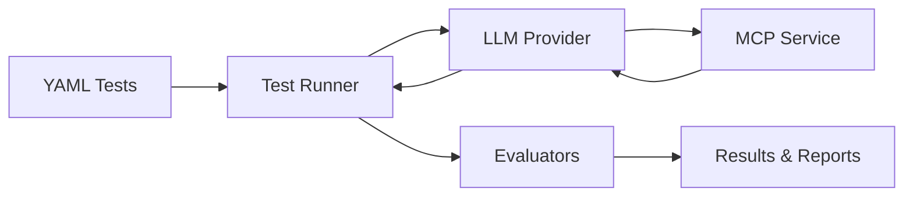

# Concepts

testmcpy is a testing and evaluation framework for MCP (Model Context Protocol) services. The core idea: you describe what an LLM should accomplish with your MCP tools, run it for real, and assert on what actually happened.

The pipeline looks like this:

1. **Tests** — You write test cases in YAML: a natural-language prompt plus a list of evaluators. See [Test Format](/concepts/test-format).
2. **Runner** — The test runner loads your tests, connects to the MCP service, and orchestrates execution. See [Architecture](/concepts/architecture).
3. **LLM Provider** — A real LLM (Anthropic, OpenAI, or local Ollama) receives the prompt along with the MCP service's tool definitions and decides which tools to call.
4. **MCP Service** — Your service under test executes the tool calls and returns results. Connection details and credentials come from [Configuration](/concepts/configuration), [MCP Profiles](/concepts/mcp-profiles), and [Authentication](/concepts/authentication).
5. **Evaluators** — Each test's evaluators inspect the full transcript — tool calls, parameters, results, final response, timing, and cost — and pass or fail. See [Evaluators](/concepts/evaluators).
6. **Results** — The runner aggregates pass/fail results, performance metrics, and cost into reports (terminal, JSON, HTML, Markdown).

Ready to write your first test? Start with [Getting Started](/getting-started) or jump to [Writing Tests](/guides/writing-tests).
